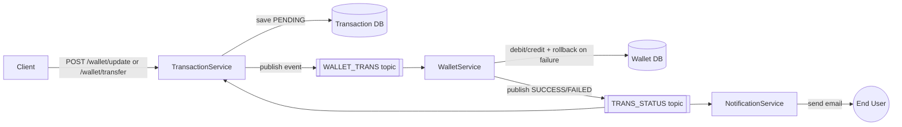

# PayLegderService – Event-Driven E-Wallet Microservices Platform

PayFlow is a Java Spring Boot microservices application that simulates a digital wallet system. It handles user wallet top-ups, withdrawals, and peer-to-peer transfers, with asynchronous processing and email notifications powered by Apache Kafka.

The project is split into four independently deployable services — **User**, **Wallet**, **Transaction**, and **Notification** — each with its own REST API and its own database, communicating with one another through Kafka events rather than direct synchronous calls.

---

## Why I Built This

I built PayFlow to understand how production-style payment systems maintain data consistency and communicate across services **without** relying on distributed transactions or direct service-to-service calls. Specifically, I wanted hands-on experience with:

- Designing a wallet/transaction domain where correctness (no lost or double-counted money) actually matters, and using `@Transactional` + rollback handling to enforce it at the DB layer.
- Using Kafka as the backbone for inter-service communication instead of REST-to-REST calls, including topic design and isolated consumer groups so multiple services can react to the same event independently.
- Keeping services decoupled enough that a service (e.g. Notification) can be down without blocking the core wallet/transfer flow.

Working through this also surfaced real trade-offs — like the gap between "the client gets an immediate response" and "the client knows the final outcome" — which is covered below under Roadmap.

---

## Tech Stack

| Layer | Technology |
|---|---|
| Language | Java |
| Framework | Spring Boot |
| Build Tool | Maven |
| Messaging | Apache Kafka (topic-based producer/consumer, isolated consumer groups) |
| Database | MySQL (independent schema per service) |
| Data Access | Spring Data JPA |
| API Style | REST (Spring Web) |
| Transaction Handling | Spring Transaction Management (`@Transactional`, rollback on failure) |
| Notifications | Kafka-consumed events → Email (SMTP) |
| Architecture | Microservices, event-driven |

---

## Architecture



Each service owns its own database and exposes its own REST API. Services never call each other synchronously — all cross-service coordination happens through Kafka topics, which keeps the services loosely coupled and independently scalable.

---

## Services

### 1. User Service
Manages user registration and profile data, exposed via its own REST API and backed by its own MySQL schema.

### 2. Wallet Service
Owns the wallet balance for each user. Consumes wallet-update events from Kafka and applies debit/credit operations using **Spring Transaction Management**, with rollback handling and custom exception flows to guarantee data consistency if an operation fails mid-way (e.g. insufficient balance, DB error).

### 3. Transaction Service
Exposes the primary client-facing REST endpoints:

- `POST /wallet/update` — top-up or withdrawal for a single user
- `POST /wallet/transfer` — transfer between two users

Every request is converted into a `Transaction` entity (unique `transactionId` generated via `UUID`), persisted with status `PENDING`, and published to Kafka for asynchronous processing by the Wallet Service. The final `SUCCESS` / `FAILED` status is written back once the Wallet Service completes the operation.

**Example — Transfer request**
```http
POST /wallet/transfer
Content-Type: application/json

{
  "senderId": 1,
  "receiverId": 2,
  "amount": 500.0,
  "description": "Payment for groceries"
}
```

**Example — Immediate response**
```json
{
  "transactionId": "a1b2c3d4-...",
  "senderId": 1,
  "receiverId": 2,
  "amount": 500.0,
  "description": "Payment for groceries",
  "status": "PENDING"
}
```

For a single-user top-up/withdrawal (`/wallet/update`), the "missing" counterpart (sender for a top-up, receiver for a withdrawal) is represented internally with a sentinel value.

### 4. Notification Service
Subscribes to the final transaction-status Kafka topic and triggers an **email alert** to the user once a transaction resolves to `SUCCESS` or `FAILED`. This keeps notification logic completely decoupled from the transaction/wallet processing flow.

---

## Kafka Topics

| Topic | Producer | Consumer(s) | Purpose |
|---|---|---|---|
| `WALLET_TRANS` | Transaction Service | Wallet Service | Carries pending wallet operations for processing |
| `TRANS_STATUS` | Wallet Service | Transaction Service, Notification Service | Carries the final SUCCESS/FAILED outcome |

Each consumer runs in its own isolated consumer group so that the Transaction Service and Notification Service can independently process the same status event without interfering with one another.

---

## Project Structure

```
internal-ewallet/
├── user-service/
│   └── src/...
├── wallet-service/
│   └── src/
│       └── main/java/.../wallet/
│           ├── controller/
│           ├── service/
│           ├── repository/
│           └── model/
├── transaction-service/
│   └── src/...
└── notification-service/
    └── src/...
```

---

## Getting Started

### Prerequisites
- Java `<!-- e.g. 17 -->` (check the `<java.version>` in `pom.xml`)
- Spring Boot `<!-- e.g. 3.2.x -->` (check the parent version in `pom.xml`)
- Maven `<!-- e.g. 3.9.x -->`
- Apache Kafka `<!-- e.g. 3.6.x -->` + Zookeeper, running locally (started manually — no `docker-compose` included in this project)
- MySQL `<!-- e.g. 8.0 -->`, with a separate schema/database created for each service

> Fill in the exact versions above from your `pom.xml` before publishing — interviewers sometimes clone the repo and run it, so vague or missing versions cause avoidable setup friction.

### 1. Set up MySQL
Create a database for each service and update the `application.properties` (or `.yml`) in each module with your local credentials:

```properties
spring.datasource.url=jdbc:mysql://localhost:3306/<service_db_name>
spring.datasource.username=root
spring.datasource.password=yourpassword
spring.jpa.hibernate.ddl-auto=update
```

### 2. Start Kafka & Zookeeper
```bash
# from your local Kafka installation directory
bin/zookeeper-server-start.sh config/zookeeper.properties
bin/kafka-server-start.sh config/server.properties
```

### 3. Build and run each service
From each service's root folder:
```bash
mvn clean install
mvn spring-boot:run
```
Start them in this order: **User → Wallet → Transaction → Notification**, so consumers are up before events start flowing.

### 4. Test an endpoint
```bash
curl -X POST http://localhost:<transaction-service-port>/wallet/transfer \
  -H "Content-Type: application/json" \
  -d '{"senderId":1,"receiverId":2,"amount":500.0,"description":"Payment for groceries"}'
```

---

## Testing

Endpoints were tested manually using Postman, covering:
- Successful top-up, withdrawal, and transfer flows end-to-end (request → `PENDING` response → Kafka event → DB status update → email notification).
- Failure scenarios (e.g. insufficient wallet balance) to verify rollback handling and that the transaction correctly resolves to `FAILED` instead of leaving inconsistent state.

*(Update this section if you've since added JUnit/Mockito unit tests or integration tests — mention specific classes/coverage if so, since automated tests are one of the first things interviewers ask about at this level.)*

---

## Known Limitations / Roadmap

- **No real-time status push to the client.** The client currently only learns the final outcome via the email notification; there is no polling endpoint or WebSocket push yet.
  - Planned: a lightweight `GET /transaction/status?transactionId=...` polling endpoint as a quick win, and a WebSocket-based push (`SimpMessagingTemplate`) for true real-time updates in a production setting.
- No API gateway or service discovery (e.g. Eureka) yet — services are called on fixed ports.
- No centralized authentication/authorization layer across services yet.

---

## License

This project is licensed under the MIT License.

## Author

Built as a personal project to learn and demonstrate event-driven microservices design with Spring Boot and Kafka.
